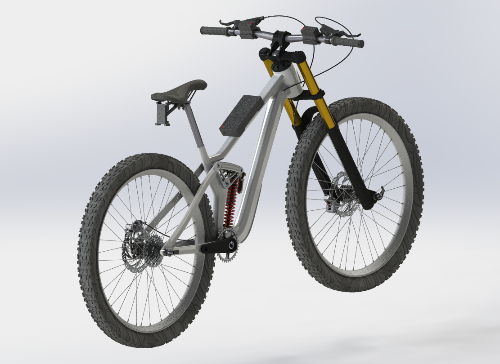
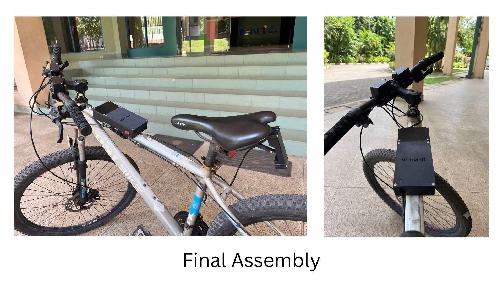
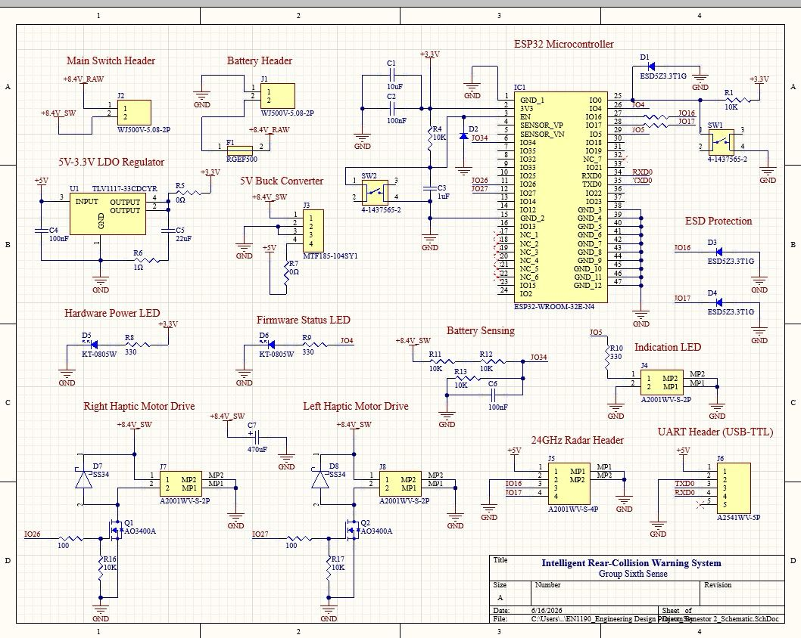
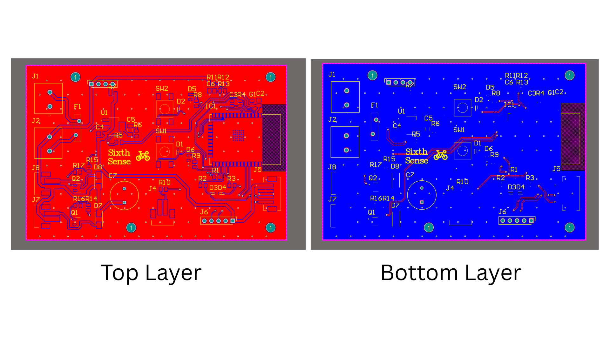
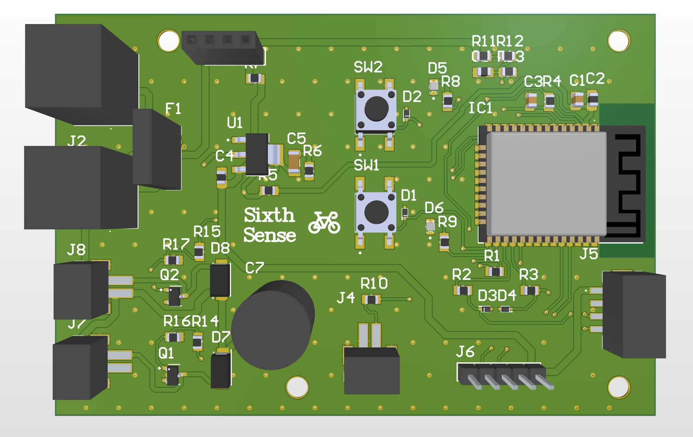

<div align="center">

# 🚴 Sixth Sense

### Intelligent Rear-Collision Warning System for Cyclists

*A radar-powered embedded safety system that gives cyclists a new sense of awareness through intuitive haptic feedback.*


**Engineering Design Project**

Department of Electronic & Telecommunication Engineering  
University of Moratuwa


</div>

---

# The Problem

Every cyclist knows the feeling.

You're riding with your eyes fixed ahead.

Then...

A vehicle approaches rapidly from behind.

Do you look over your shoulder?

Do you trust your hearing?

Do you hope nothing is beside you?

That split second of uncertainty is exactly where accidents happen.

**Sixth Sense was created to eliminate that uncertainty.**

---

# Introducing Sixth Sense

Sixth Sense is a radar-assisted cyclist safety system that continuously monitors approaching traffic behind the rider and instantly communicates danger through directional haptic feedback.

Instead of distracting screens or loud warning sounds, the system speaks through touch.

Left side approaching?

👉 Left handlebar vibrates.

Right side approaching?

👉 Right handlebar vibrates.

Directly behind?

👉 Both handlebars respond.

The rider never needs to take their eyes off the road.

---

# Demo

## 🎥 Demo

<p align="center">
  <a href="https://drive.google.com/file/d/1ffC6w6P3MY6zFnOaW4FhN-ex5IwfBISE/view?usp=drive_link">
    
  </a>
</p>

<p align="center">
<b>▶ Click the image above to watch the demonstration</b>
</p>
# Product Showcase

## Complete System

> Replace with a professional render



---

## Mounted on Bicycle



---

# Key Features

✔ 24 GHz FMCW mmWave Radar

✔ Intelligent Rear Vehicle Detection

✔ Real-Time Embedded Processing

✔ Directional Haptic Feedback

✔ Visual LED Warning System

✔ Custom Designed PCB

✔ ESP32 Embedded Platform

✔ Battery Powered

✔ Modular Hardware Design

✔ Custom CAD Enclosures

✔ 3D Printed Prototype

✔ Lightweight Bicycle Integration

---

# How It Works

```text
          Vehicle

             │

             ▼

      24 GHz Radar Sensor

             │

             ▼

      ESP32 Embedded System

             │

   Threat Evaluation Logic

             │

    ┌────────┴────────┐

    ▼                 ▼

 Left Handle     Right Handle

 Haptic Unit     Haptic Unit

    ▼                 ▼

 Rider receives intuitive tactile warning
```

---

# System Architecture

> Replace with system architecture image


---

# Hardware Overview

## Rear Radar Module

Captures approaching vehicles using 24 GHz FMCW radar technology.

📷

```
assets/images/rear_sensor.jpg
```

---

## Central Processing Unit

The brain of the system.

Contains

- ESP32
- Custom PCB
- Power Electronics
- Battery
- Firmware

📷


---

## Haptic Feedback Units

Mounted beside both brake levers to provide intuitive directional warnings.

📷

```
assets/images/haptic_units.jpg
```

---

# Electronics

## Custom PCB

Professional two-layer PCB designed specifically for Sixth Sense.

### Schematic



### PCB Layout



### 3D PCB



# Mechanical Design

Designed completely in **SolidWorks**

## Initial Concepts

```
assets/images/concepts.png
```

---

## Engineering Drawings

```
assets/images/drawings.png
```

---

## Exploded Assembly

```
assets/images/exploded.png
```

---

## CAD Assembly

```
assets/images/cad_assembly.png
```

---

# Prototype

## Final Assembly

```
assets/images/final_prototype.png
```

---

# Built With

| Category | Technology |
|------------|------------|
| MCU | ESP32 |
| Sensor | 24 GHz mmWave Radar |
| Programming | Arduino C++ |
| PCB | Altium Designer |
| CAD | SolidWorks |
| Manufacturing | 3D Printing |

---

# Repository Structure

```
SixthSense/

│

├── Firmware/
│
├── PCB/
│
├── CAD/
│
├── Documentation/
│
├── assets/
│
├── Images/
│
└── README.md
```

---

# Design Philosophy

Rather than overwhelming cyclists with screens, sounds, and unnecessary distractions...

Sixth Sense quietly augments the rider's natural awareness.

It becomes an extension of instinct.

Not another gadget.

---

# Future Vision

- Smartphone Integration
- Bluetooth Connectivity
- Companion Mobile Application
- USB-C Charging
- Waterproof Housing
- Miniaturized PCB
- AI-based Traffic Behaviour Analysis
- Commercial Manufacturing

---

# Gallery

| | |
|---|---|
|  |  |
|  |  |

---

# Development Team

| Member | Contribution |
|---------|--------------|
| H.R.A.I. Jayasinghe | Electronics • PCB • System Design |
| T.U. Dambarage | Firmware • Algorithms • Mechanical Design |
| S.N. Jayasooriya | PCB • Firmware • Testing |
| A.Y.D. Perera | Schematic Design • Mechanical Design • Assembly |


From Left to Right => A.Y.D. Perera, H.R.A.I. Jayasinghe, T.U. Dambarage,  S.N. Jayasooriya


# Acknowledgements

Department of Electronic and Telecommunication Engineering

University of Moratuwa

Engineering Design Project

---

<div align="center">

## ⭐ If you like this project, consider giving it a Star.

*"Making cycling safer, one vibration at a time."*

</div>
